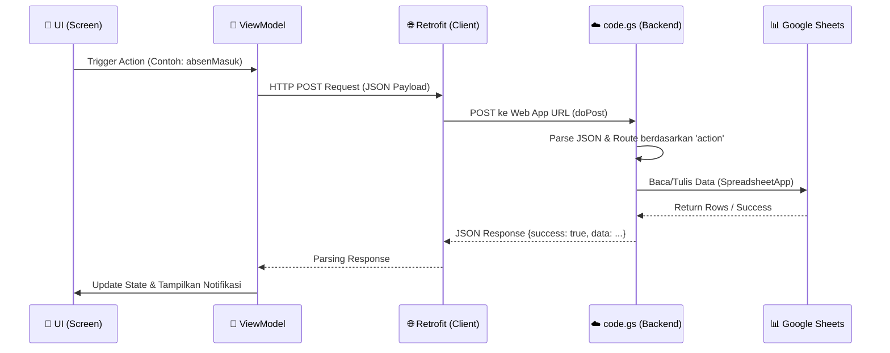
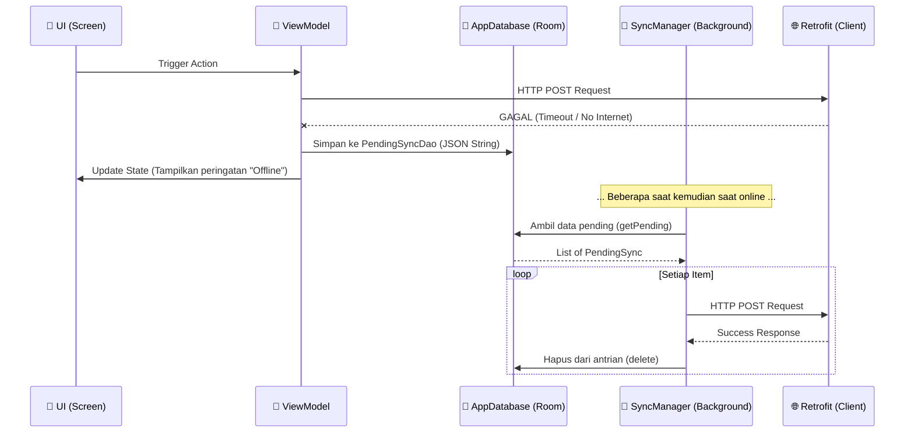

# 🔄 PETA ALUR DATA (DATA FLOW MAP)

Dokumen ini memetakan bagaimana data mengalir dari interaksi pengguna di aplikasi Android (Native) hingga tersimpan secara permanen di Google Sheets, termasuk penanganan mode *Offline-First*.

---

## 1. ALUR DATA STANDAR (ONLINE MODE)

Ini adalah alur normal ketika Karyawan atau Admin melakukan suatu aksi (contoh: Absen Masuk, Kirim Chat, Ajukan Izin) dengan koneksi internet yang stabil.

---

## 2. ALUR DATA OFFLINE-FIRST (PENDING SYNC)

Aplikasi ini menggunakan pola **Offline-First**. Ini berarti jika koneksi internet terputus, aplikasi tidak akan macet atau langsung gagal, melainkan menyimpan permintaan tersebut ke dalam antrian lokal (Database SQLite/Room) untuk dikirim kemudian.

---

## 3. RINCIAN PER-LAPISAN (LAYER DETAILS)

### A. Lapisan Presentasi (Android Client - Kotlin)
1. **Screen (.kt):** File Jetpack Compose (misal: `AbsensiScreen.kt`, `ChatScreen.kt`). Bertugas mendengarkan event pengguna (klik tombol) dan mengamati (*observe*) `StateFlow` dari ViewModel.
2. **ViewModel (.kt):** Memvalidasi input (contoh: cek jarak GPS, cek form kosong), menyusun data request (`AbsenMasukRequest`), dan memanggil fungsi API. ViewModel juga bertanggung jawab memperbarui `CacheManager` agar UI terasa cepat (Optimistic UI Update).

### B. Lapisan Jaringan & Penyimpanan Lokal
1. **RetrofitClient:** Mengubah objek Kotlin menjadi JSON dan mengirimkannya via HTTP POST ke Google Apps Script. Semua *request* dikirim menggunakan metode `POST`.
2. **Room Database (`AppDatabase` & `PendingSyncDao`):** Jika Retrofit gagal karena koneksi, JSON payload disimpan utuh sebagai string di tabel `pending_sync`.
3. **CacheManager (SharedPreferences):** Menyimpan salinan data terakhir (seperti jadwal, info toko, info karyawan) agar aplikasi bisa merender layar tanpa harus menunggu loading dari jaringan.

### C. Lapisan Backend (Google Apps Script - `code.gs`)
1. **Entry Point (`doPost`):** Menangkap *request* dari aplikasi Android.
   - Mengambil data dari `e.postData.contents`.
   - Mengubah JSON string menjadi objek JavaScript.
   - Melakukan pengecekan keamanan (jika ada enkripsi/signature).
2. **Router / Switch Case:** Membaca properti `data.action` (contoh: `"absenMasuk"`, `"login"`) dan mengarahkan ke fungsi khusus yang menanganinya.
3. **Handler Functions:** Fungsi spesifik (contoh: `absenMasuk(data)`). Bertugas memvalidasi data *backend-side* (contoh: cek radius ulang, cek shift ganda).

### D. Lapisan Database (Google Sheets)
1. **Pembacaan (Read):** Fungsi seperti `getSheetData()` mengambil seluruh data di sheet (menggunakan `.getDataRange().getValues()`). Index array digunakan untuk mencocokkan kolom (Contoh: `row[0]` untuk Timestamp).
2. **Penulisan (Write):** Fungsi memanggil `.appendRow(array)`. Panjang array **harus** presisi sesuai jumlah kolom di Sheet untuk mencegah data bergeser.
3. **Pembaruan (Update):** Jika ada update, backend mencari baris spesifik (looping array), lalu memanggil `sheet.getRange(rowIndex, colIndex).setValue(newValue)`.

---

## 4. CONTOH KASUS: ALUR DATA ABSEN MASUK

1. **User (HP):** Klik tombol "ABSEN MASUK".
2. **ViewModel (`AbsensiViewModel.absenMasuk`):** 
   - Kompres foto selfie ke Base64.
   - Ambil koordinat GPS.
   - Buat objek `AbsenMasukRequest`.
   - Coba kirim langsung via `RetrofitClient.instance.absenMasuk(request)`.
3. **Jika Sukses Koneksi (Backend - `code.gs`):**
   - Masuk ke `doPost` -> route ke fungsi `absenMasuk(data)`.
   - Buka sheet `ABSENSI`, lakukan pengecekan apakah karyawan ini sudah masuk hari ini.
   - Jika belum, panggil `sheet.appendRow(...)` untuk mencatat waktu masuk.
   - Return `{success: true, message: "Berhasil Absen"}`.
4. **Jika Gagal Koneksi (Offline Mode):**
   - Retrofit melempar Exception.
   - Block `catch` berjalan: Konversi `request` menjadi JSON String.
   - Panggil `db.pendingSyncDao().insert(...)` untuk menabung data.
   - Simpan cache status ke `pending_masuk`.
   - Tampilkan peringatan "Offline" ke Karyawan. Peringatan ini berarti data aman, hanya belum sampai ke awan.
