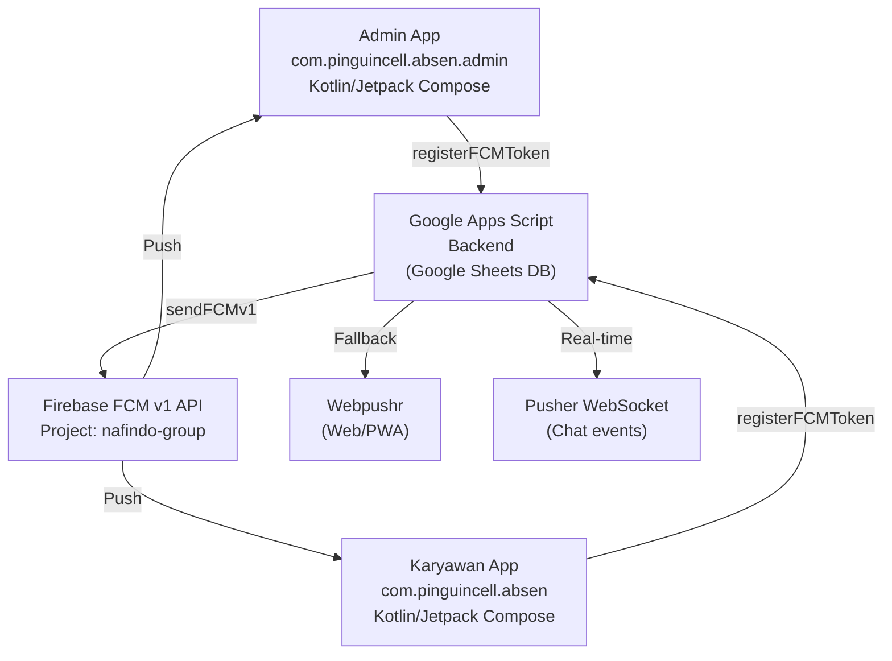

# Bongkar Struktur FCM: Komunikasi Admin ↔ Karyawan ↔ Karyawan

## Konteks

Saat ini sistem FCM sudah berjalan sebagian. Setelah riset mendalam terhadap kedua app (admin + karyawan) dan backend Google Apps Script, berikut temuan dan rencana perbaikan.

## Arsitektur Saat Ini



## Status FCM Saat Ini

| Alur Komunikasi | Status | Keterangan |
|---|---|---|
| **Backend → Karyawan** | ✅ Berjalan | Saat absen masuk/pulang, lembur, izin → karyawan terima notif |
| **Backend → Karyawan (Chat)** | ✅ Berjalan | Broadcast chat ke semua karyawan kecuali pengirim |
| **Backend → Admin** | ❌ TIDAK ADA | Tidak ada `sendPushNotification` ke admin saat karyawan absen, ajukan lembur/izin, atau kirim chat |
| **Karyawan → Admin** (via backend) | ❌ TIDAK ADA | Admin tidak terima notif ketika karyawan melakukan aksi |
| **Admin → Karyawan** (approval) | ✅ Berjalan | Saat approveLembur/approveIzin, backend kirim notif ke karyawan |
| **Karyawan → Karyawan** (tukar shift) | ✅ Berjalan | Saat ajukanTukerShift, backend kirim notif ke karyawan tujuan |

## Masalah Inti

> [!IMPORTANT]
> **Admin tidak pernah menerima FCM notification** dari aktivitas karyawan. Saat karyawan absen, ajukan lembur/izin/tukar shift, atau kirim chat — admin tidak diberitahu.

### Penyebab:
1. `sendPushNotification()` di backend hanya mencari token berdasarkan `idKaryawan` dari sheet `MASTER_KARYAWAN`
2. Admin login dengan ID seperti `"admin"` yang mungkin **tidak ada** di sheet `MASTER_KARYAWAN`
3. **Tidak ada fungsi `sendPushNotificationToAdmin()`** atau `sendPushNotificationToRole()` di backend
4. Admin token disimpan di PropertiesService dengan key `FCM_admin` tapi tidak pernah di-query saat event karyawan

---

## Proposed Changes

### 1. Backend (`code.gs`) — Tambah fungsi notifikasi ke admin

#### [MODIFY] [code.gs](file:///d:/absen/absen-native/code.gs)

**a) Tambah fungsi `sendPushNotificationToAllAdmin()`:**
- Query sheet `MASTER_KARYAWAN` untuk cari semua user dengan `Jabatan == 'Admin'` atau `Jabatan == 'Owner'`
- Ambil FCM token masing-masing admin
- Kirim notifikasi ke semua admin
- Juga cek `FCM_admin` di PropertiesService sebagai fallback

**b) Tambah notifikasi ke admin di event-event penting:**

| Event | Notifikasi ke Admin |
|---|---|
| `absenMasuk()` | "📍 {nama} absen masuk di {toko}" |
| `absenPulang()` | "🏠 {nama} absen pulang" |
| `ajukanLembur()` | "⏰ {nama} mengajukan lembur" |
| `ajukanIzin()` | "📋 {nama} mengajukan {jenisIzin}" |
| `ajukanTukerShift()` | "⇆ {nama} mengajukan tukar shift" |
| `sendChatMessage()` | *(sudah broadcast ke semua — admin juga akan termasuk jika ada di MASTER_KARYAWAN)* |

**c) Tambah action `sendManualPushNotification` di doPost switch:**
- Admin bisa kirim notifikasi manual ke karyawan tertentu atau semua karyawan
- Saat ini action ini ada di admin.js tapi **TIDAK terdaftar di doPost router** (bug)

**d) Tambah fungsi `sendPushNotificationToMultiple()` untuk batch sending:**
- Kirim ke multiple ID sekaligus tanpa loop API calls terpisah

---

### 2. Admin App (`absen-admin`) — Pastikan FCM token terdaftar benar

#### [MODIFY] [MainActivity.kt](file:///d:/absen/absen-admin/app/src/main/java/com/pinguincell/absen/admin/MainActivity.kt)

- Pastikan saat admin login, FCM token didaftarkan dengan **ID yang benar** (bukan hardcode `"admin"`)
- Verifikasi bahwa ID admin yang tersimpan di SharedPreferences cocok dengan yang ada di sheet `MASTER_KARYAWAN`

---

### 3. Employee App (`absen-native`) — Sudah berjalan baik

Tidak ada perubahan signifikan diperlukan di app karyawan. FCM receiving dan token registration sudah benar.

---

## Detail Implementasi Backend

### Fungsi Baru: `sendPushNotificationToAllAdmin()`

```javascript
function sendPushNotificationToAllAdmin(title, message, channelId, extraData) {
  channelId = channelId || 'general_channel';
  try {
    const allKaryawan = getSheetData(SHEET_NAMES.MASTER_KARYAWAN);
    const admins = allKaryawan.filter(k => 
      k.Status === 'Aktif' && 
      (k.Jabatan === 'Admin' || k.Jabatan === 'Owner' || k.Jabatan === 'admin')
    );
    
    admins.forEach(admin => {
      try {
        sendPushNotification(admin.ID_Karyawan, title, message, channelId, extraData || {});
      } catch(e) {
        Logger.log('Gagal kirim notif ke admin ' + admin.ID_Karyawan + ': ' + e.toString());
      }
    });
    
    // Fallback: coba juga kirim ke FCM_admin (jika login sebagai "admin")
    try {
      const adminToken = PropertiesService.getScriptProperties().getProperty('FCM_admin');
      if (adminToken) {
        sendFCMv1(adminToken, title, message, channelId, extraData || {});
      }
    } catch(e) {}
    
  } catch(e) {
    Logger.log('sendPushNotificationToAllAdmin error: ' + e.toString());
  }
}
```

### Fungsi Baru: `sendManualPushNotification()`

```javascript
function sendManualPushNotification(data) {
  const { targetId, targetRole, title, message, channelId } = data;
  
  if (!title || !message) return { success: false, error: 'Title dan message wajib diisi' };
  
  if (targetId && targetId !== 'ALL') {
    // Kirim ke satu karyawan
    sendPushNotification(targetId, title, message, channelId || 'general_channel');
    return { success: true, message: 'Notifikasi terkirim ke ' + targetId };
  }
  
  // Kirim ke semua karyawan aktif
  const allKaryawan = getSheetData(SHEET_NAMES.MASTER_KARYAWAN).filter(k => k.Status === 'Aktif');
  allKaryawan.forEach(k => {
    try { sendPushNotification(k.ID_Karyawan, title, message, channelId || 'general_channel'); } catch(e) {}
  });
  
  return { success: true, message: 'Notifikasi broadcast terkirim ke ' + allKaryawan.length + ' karyawan' };
}
```

---

## Verifikasi

### Titik-titik yang akan dimodifikasi di `code.gs`:

1. **`sendPushNotificationToAllAdmin()`** — Fungsi baru (setelah line 3561)
2. **`sendManualPushNotification()`** — Fungsi baru + daftarkan di doPost switch
3. **`absenMasuk()`** (line ~750) — Tambah `sendPushNotificationToAllAdmin()`
4. **`absenPulang()`** (line ~881) — Tambah `sendPushNotificationToAllAdmin()`
5. **`ajukanLembur()`** (line ~1093) — Tambah `sendPushNotificationToAllAdmin()`
6. **`ajukanIzin()`** (line ~1182) — Tambah `sendPushNotificationToAllAdmin()`
7. **`ajukanTukerShift()`** (line ~2972) — Tambah `sendPushNotificationToAllAdmin()`
8. **`sendChatMessage()`** (line ~2909) — Pastikan admin juga termasuk di broadcast (sudah auto-include jika admin ada di MASTER_KARYAWAN)
9. **`doPost()` switch** (line ~183) — Tambah case `'sendManualPushNotification'`

### Admin App:
10. **`MainActivity.kt`** — Verifikasi bahwa FCM token registration pakai ID yang benar

---

## User Review Required

> [!IMPORTANT]
> **ID Admin di MASTER_KARYAWAN**: Apakah admin sudah terdaftar di sheet `MASTER_KARYAWAN` dengan kolom `Jabatan` = `'Admin'` atau `'Owner'`? Ini penting agar `sendPushNotificationToAllAdmin()` bisa menemukan admin. Jika belum, kita perlu menambahkannya.

> [!IMPORTANT]  
> **Apakah admin login dengan ID tertentu?** Saat ini di `MainActivity.kt` admin app, default userId adalah `"admin"` (bukan dari sheet). Tolong konfirmasi: apakah admin login dengan ID spesifik yang ada di sheet MASTER_KARYAWAN, atau login sebagai `"admin"` fixed?

## Open Questions

1. **Chat notification ke admin**: Saat karyawan kirim chat, apakah admin juga mau terima notif? Saat ini chat broadcast sudah ke semua karyawan di MASTER_KARYAWAN — jika admin terdaftar di situ, admin juga akan terima otomatis.

2. **Notifikasi manual dari admin**: Apakah fitur kirim notifikasi manual (dari admin ke karyawan) sudah diperlukan sekarang, atau nanti saja?

## Verification Plan

### Automated Tests
- Deploy code.gs yang sudah dimodifikasi ke Google Apps Script
- Test register FCM token via Postman/curl
- Test notifikasi ke admin saat karyawan absen

### Manual Verification
- Build APK admin, install di HP admin
- Build APK karyawan, install di HP karyawan  
- Karyawan absen masuk → cek admin terima notif
- Karyawan ajukan lembur → cek admin terima notif
- Karyawan kirim chat → cek admin terima notif
- Admin approve lembur → cek karyawan terima notif
- Karyawan A tukar shift dengan B → cek B terima notif
